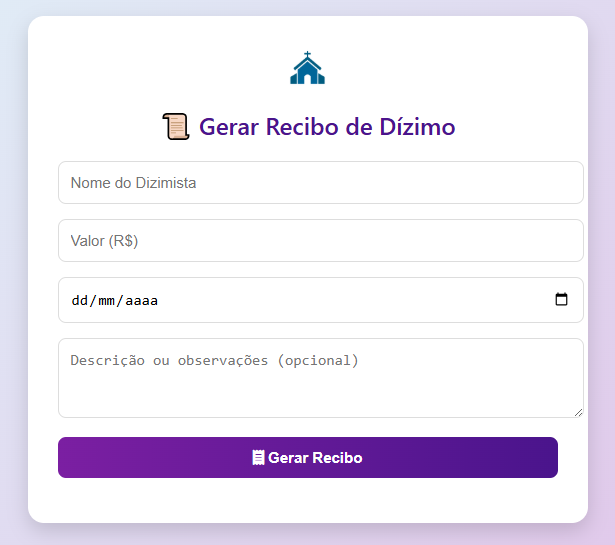
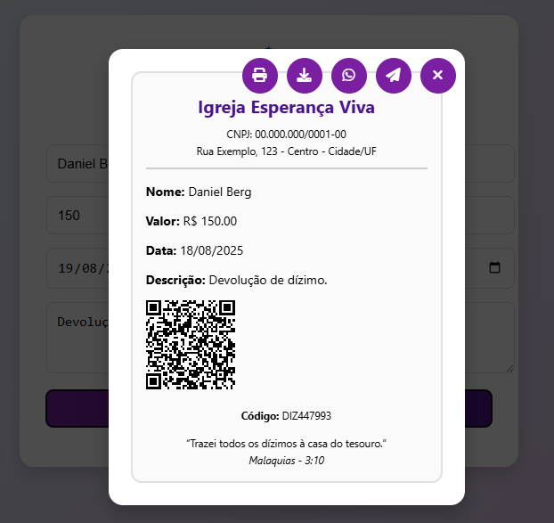

# 📜 Sistema de Recibo de Dízimo

Este projeto é um sistema web para **gerar recibos de dízimo de forma rápida, prática e digital**.  
Com ele, é possível criar um recibo personalizado, gerar um código de autenticação, incluir QR Code, imprimir, baixar em PNG ou compartilhar diretamente pelo WhatsApp.

---

## 🚀 Tecnologias Utilizadas

- **HTML5** → Estrutura da aplicação  
- **CSS3** → Estilização moderna e responsiva  
- **JavaScript (ES6)** → Lógica de geração do recibo  
- **[html2canvas](https://html2canvas.hertzen.com/)** → Captura e exportação do recibo em imagem  
- **[QRCode.js](https://github.com/davidshimjs/qrcodejs)** → Geração dinâmica de QR Codes  
- **Font Awesome** → Ícones modernos  

---

## 🎯 Funcionalidades

✅ Gerar recibo de dízimo com:  
- Nome do dizimista  
- Valor (R$)  
- Data  
- Descrição / Observações  

✅ Recursos extras:  
- Código de autenticação único  
- Geração automática de QR Code  
- Visualização imediata em modal  
- Impressão do recibo  
- Download em PNG  
- Compartilhamento via WhatsApp  
- Compartilhamento direto como imagem (PWA compatível)  

---

## 📂 Estrutura do Projeto

├── index.html # Estrutura completa do sistema
├── assets/ # Pasta para armazenar imagens e prints do sistema

yaml
Copiar
Editar

---

## ⚡ Como Usar Localmente

1. Clone este repositório:
   ```bash
   git clone https://github.com/ReiBrito/Recibo-Dizimo.git
Acesse a pasta do projeto:

bash
Copiar
Editar
cd Recibo-Dizimo
Abra o arquivo index.html no navegador:

bash
Copiar
Editar
start index.html   # Windows
open index.html    # Mac
xdg-open index.html # Linux
Preencha os campos e clique em Gerar Recibo.

🌐 Deploy no GitHub Pages
Suba seu repositório para o GitHub.

Vá em Configurações > Pages.

Em Source, selecione a branch main (ou master) e a pasta /root.

O GitHub Pages vai gerar um link no formato:

👉 https://ReiBrito.github.io/Recibo-Dizimo/

🖼️ Demonstração

* TELA INICIAL
  


* TELA INICIAL
  



📌 Melhorias Futuras

📤 Exportar recibo em PDF além de PNG

🎨 Opções de personalização (cores, logotipo da igreja, assinatura digital)

☁️ Armazenar recibos em banco de dados ou nuvem

📱 Versão mobile aprimorada com instalação como PWA

👨‍💻 Autor
Desenvolvido por Reinaldo Brito 💙

Sinta-se livre para contribuir ou adaptar ao seu uso!
